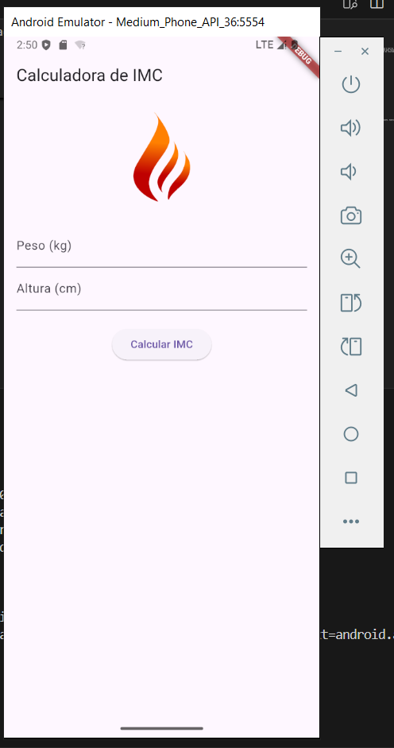
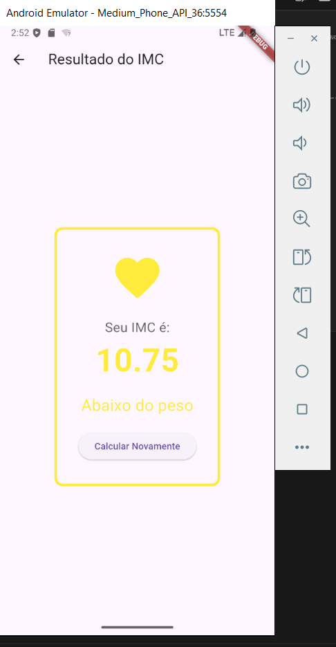
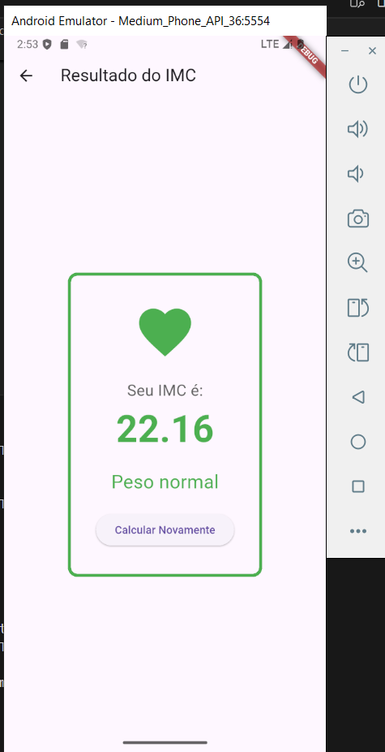
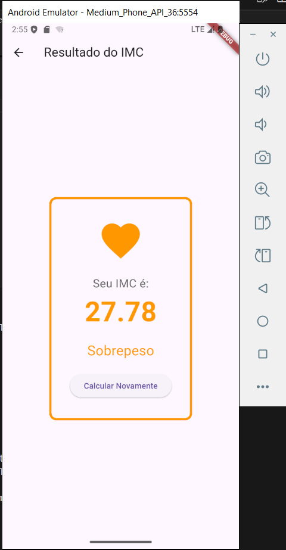
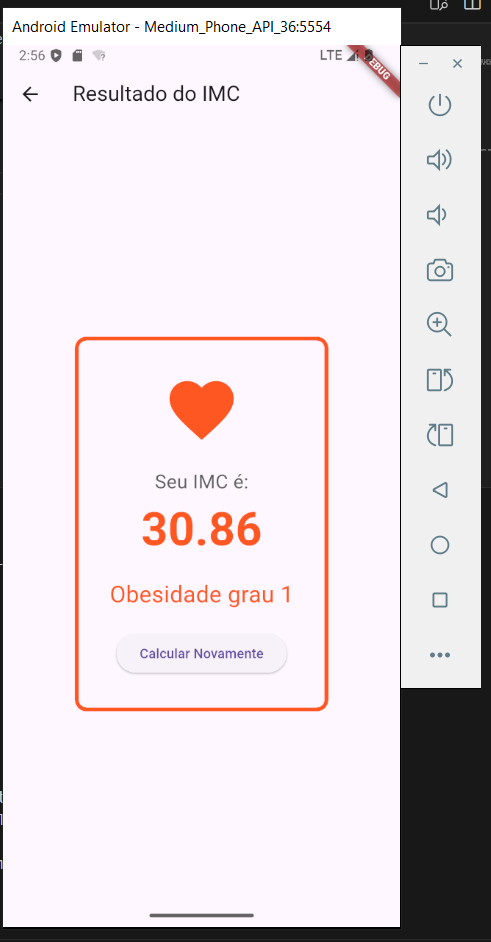
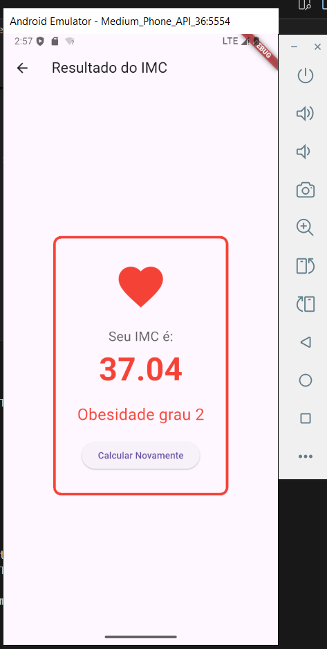
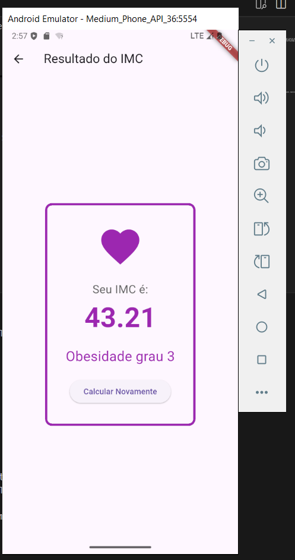

# Calculadora de IMC

## Descrição do Aplicativo

Este aplicativo, chamado **Calculadora de IMC**, tem como objetivo permitir que o usuário calcule o Índice de Massa Corporal (IMC) com base no peso e na altura fornecidos. O aplicativo informa em qual faixa de IMC o usuário se encontra, exibindo uma classificação e uma cor indicativa para facilitar a interpretação do resultado.

---

## Matrícula dos Componentes da Dupla

- Componente 1: [Inserir nome] – Matrícula: [Inserir matrícula]
- Componente 2: [Inserir nome] – Matrícula: [Inserir matrícula]

---

## Capturas de Tela

### Tela Inicial (Entrada de Dados)

### Tela de Resultado (Exemplo IMC: Abaixo do peso)

### Tela de Resultado (Exemplo IMC: Peso normal)

### Tela de Resultado (Exemplo IMC: Sobrepeso)

### Tela de Resultado (Exemplo IMC: Obesidade grau 1)

### Tela de Resultado (Exemplo IMC: Obesidade grau 2)

### Tela de Resultado (Exemplo IMC: Obesidade grau 3)

---

> **Observação:** As imagens devem estar na pasta `screenshots/` dentro do projeto. Substitua os nomes e caminhos das imagens conforme necessário.
